# Lytro Unlock - Making a bad camera slightly better


## TL;DR; summary 
I’ve recently spent some time playing with and reverse engineering this curious piece of tech that was a first consumer oriented,though odd looking, lightfield camera called Lytro. Killer feature of this new technology was the ability to refocus the image after it was taken! 
The bad side was that the software was pretty bad, the camera was trying to solve a problem that didn’t exist and the whole endeavor mostly failed. 

This project documents and implements a python library that unlocks and makes available a few interesting features that weren’t ever made available through official software. Among those are:
- full remote camera parameters control
- Live View streaming
- Debug console
- Custom code execution

Although it failed as a commercial product, lytro camera has some pretty nifty tech (only one of which is very high optical zoom). It is my hope that somebody out there has a cool idea that would benefit from having full software control over the camera. 
__If you are interested in the details, read on. Otherwise, feel free to play with supporting software under [lytroctrl](https://github.com/ea/lytroctrl).__

__No physical modifications to the cameras are neccessary to play with this. The unlocking and subsequent commands work over WiFi. 
However, there's a chance it can brick your camera (it's kind of a brick already) and it will most definitely void your waranty! Be warned!__

## The Why - Start

Anybody remember these weird rectangles from the photo above? They were all over tech news websites almost a decade ago. They were supposed to usher in the new age of photography. Some of you might have them tucked away in some drawer as a reminder of wasted money. The product promised so much, yet what it delivered in reality was oh so disappointing. 

Why did I get interested in this? Few months ago, an interesting twitter thread caught my eye. It was written by Warren Craddock and was talking about tech projects can have so much momentum that people can ignore the obvious flaws and showstoppers for a long time before they are abandoned (note: tweets have been deleted, but you can dig them up in the archive - they have some interesting insights). One of the projects he talked about was a Lytro camera. Flaws being that , due to laws of physics and optics, most of the benefits of the technology (refocus, paralax) would be of no practical use to general public. Long story short, after developing a second generation of the LightField camera called Illum (this time in a more familiar DSLR-like package) company soon went bust. 

Naturally, the first question that popped into my mind was: “I wonder how cheap those are on eBay right now?”
Sure enough, if you are patient, you can easily pick them up for anywhere from $20 to $40 dollars. A great discount from the original retail price. 
I decided to procure one, if for no other reason then simply to have it as an interesting relic. But the curiosity got the better of me and I soon found myself digging into the firmware. 

## Goals

Lets review the current state of affairs with regards to Lytro and set out some goals. 
While the company is gone, most of the online materials, firmware and software has been kindly archived in different places online. 
The camera itself has very little in terms of controls, yet you are supposed to use it as a standalone device. It’s not permanently tethered to a phone (although there is/was an app for it at some point). One would expect that, when connected to a computer, the camera would show up as a regular mass storage device, but that is not the case. Rather, you have to use Lytro software to download and process the images. Windows and OS X versions are available, but look like they were already outdated 10 years ago and leave a lot to be desired. 
Newer firmware versions support WiFi access point mode, but the official software doesn’t make much use of it. Maybe the app did once, but it doesn’t matter. No official API or documentation was ever provided.

There were a couple of community and 3rd party projects that aimed to replicate the official software and did a very good job on documenting how things work. Highlights of those are :
- [lytro meldown](http://optics.miloush.net/lytro/TheCamera.aspx) by Jan Kučera which was of immense help as it documents publicly known parts of the communication protocol, has an archive of previous firmware versions and still runs a firmware update service. 
- [Lyli](https://github.com/martin-pr/lyli/) - linux based implementation of USB communication protocol  

While both of these provide good starting points, they don’t offer much benefit over the official software, only a few extra features. 

Just looking at a product, without considering existing software, I thought it would be a lot more useful if it had features that a normal webcam would have. With that in mind, I set out to see if implementing the following was possible:
- control zoom level through software 
- Control focus point through software
- Take a picture on demand

Initially, as stretch goals I was considering:
- firmware modification
- Arbitrary code execution
- Live View / video streaming

Ok, with that, lets have a specific use case we want to make possible: Aim the camera through the window, zoom to certain level and feed the live view images to computer-vision code. Whenever a squirrel  is detected in view , take a photo. Then refocus on demand later. Wouldn't that be fun?


## Take it apart

First things first, lets take a look at how this thing is made.

Due to its unusual shape , the device  has an unusual number of boards that are interconnected. This makes it a bit of a pain to disassemble, solder wires to test points and then reassemble but just by looking at the following photos we can identify interesting things. 

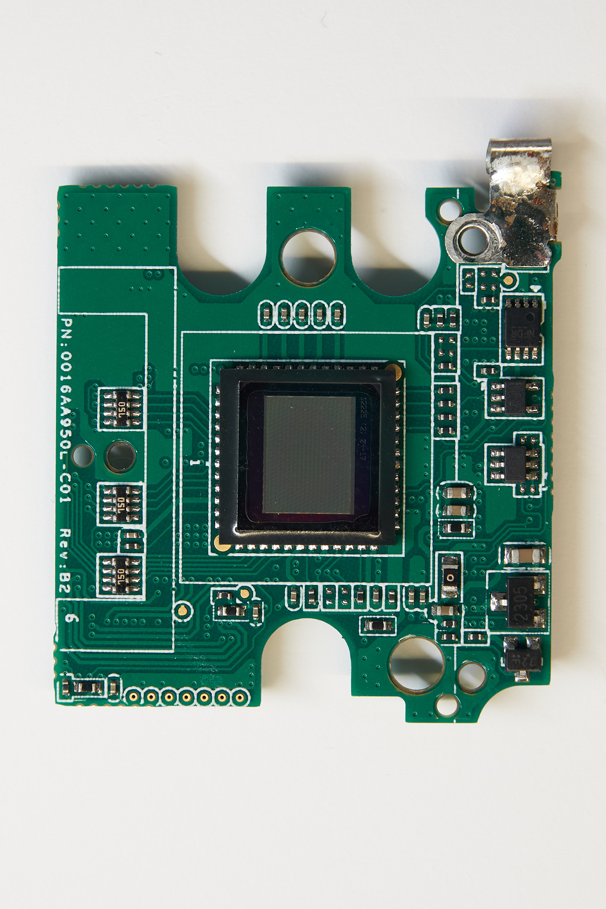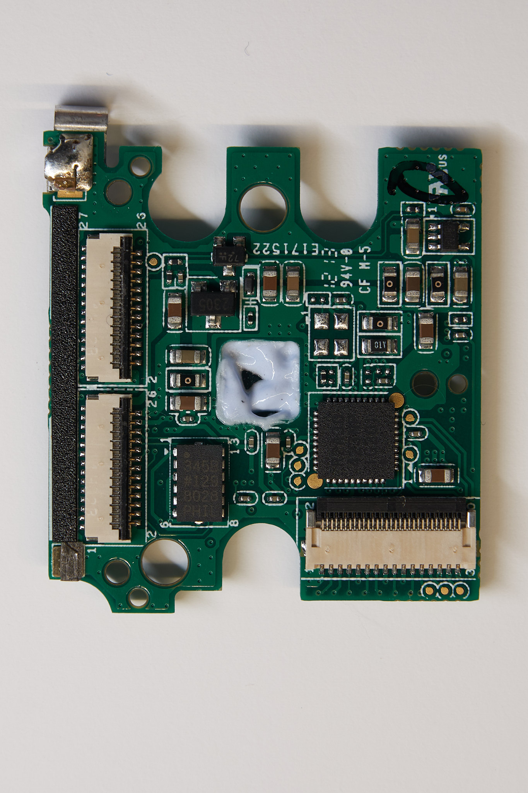


Topmost board contains the sensor with the microlens array and connects further to lens controls. Lens has tiny motors and actuators that control zoom, focus, shutter and built in neutral density filter.

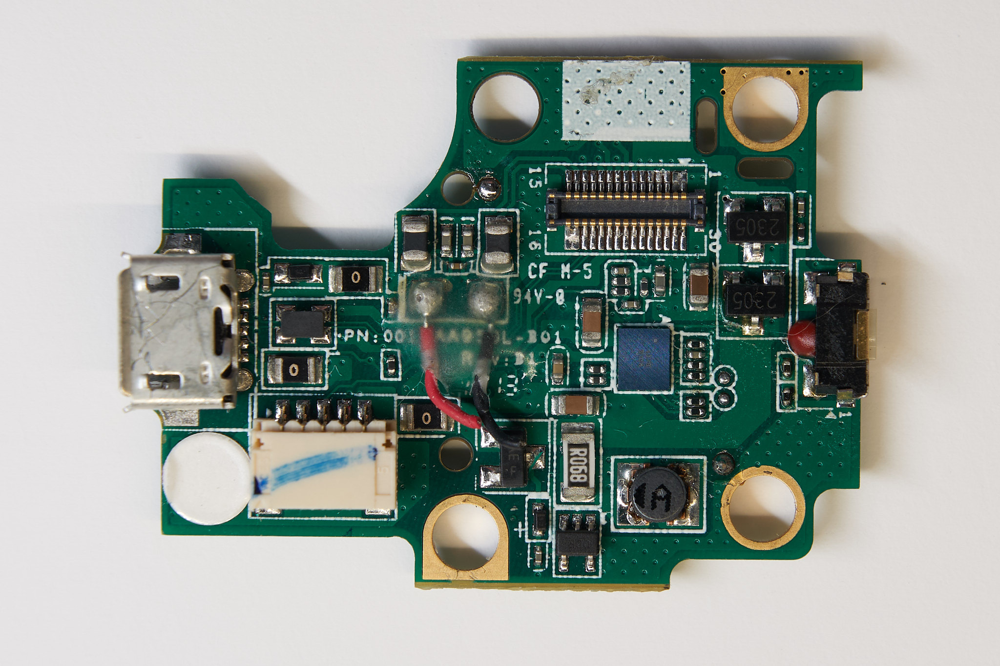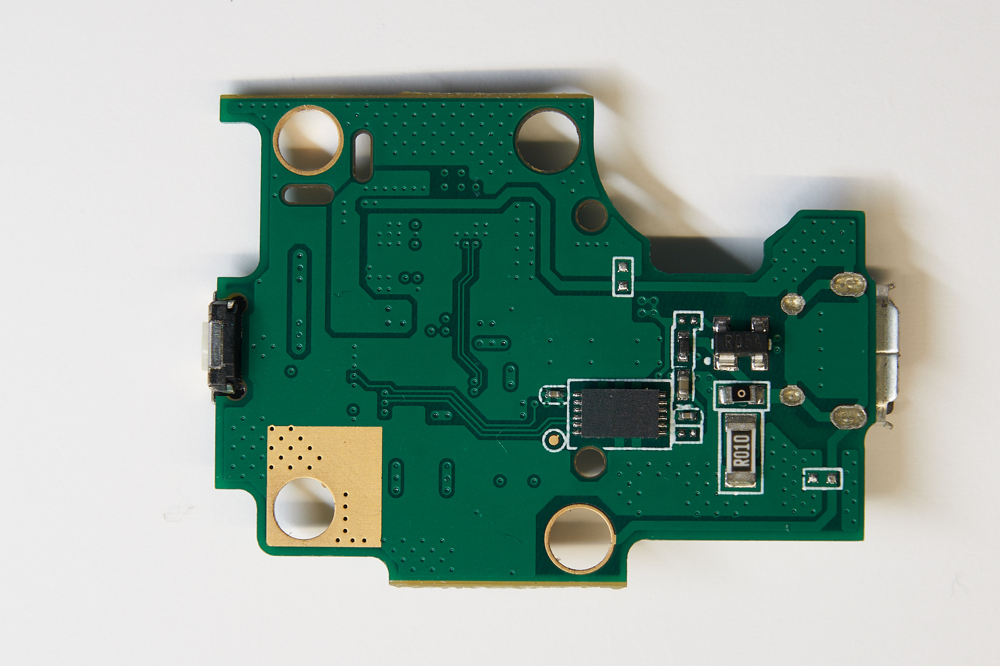

Next is a power/battery control board which is also where usb connection is located. 

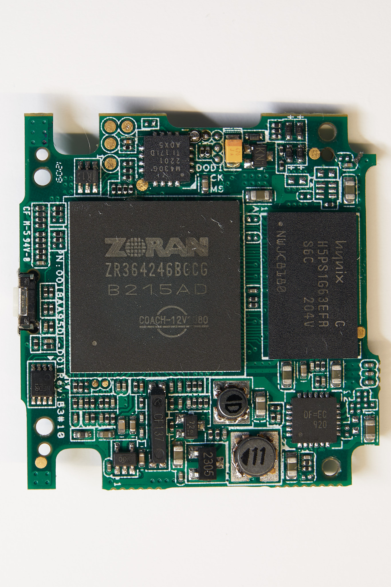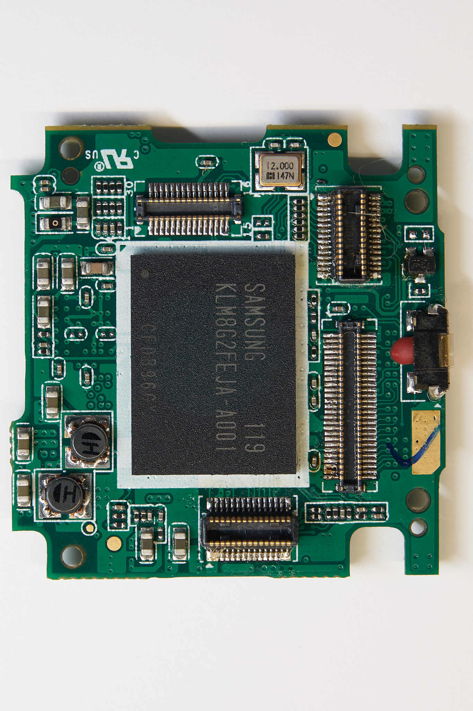

Beneath the battery is the main SoC board which is based around a MIPS MCU called Coach (Camera On A Chip) from Zoran corporation. This SoC seems to be very common with dashcam manufacturers from the same era. On the flipside, we can see Samsung’s flash and other ICs. Certain labeled test points would suggest a JTAG interface to be present. 

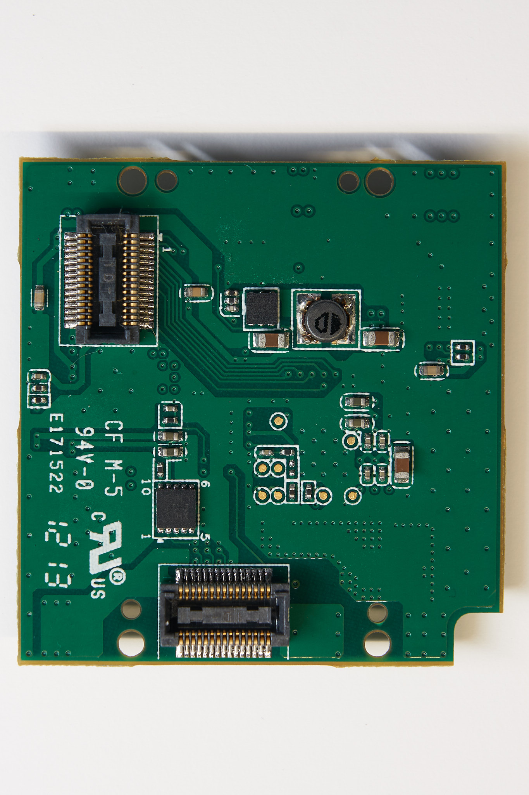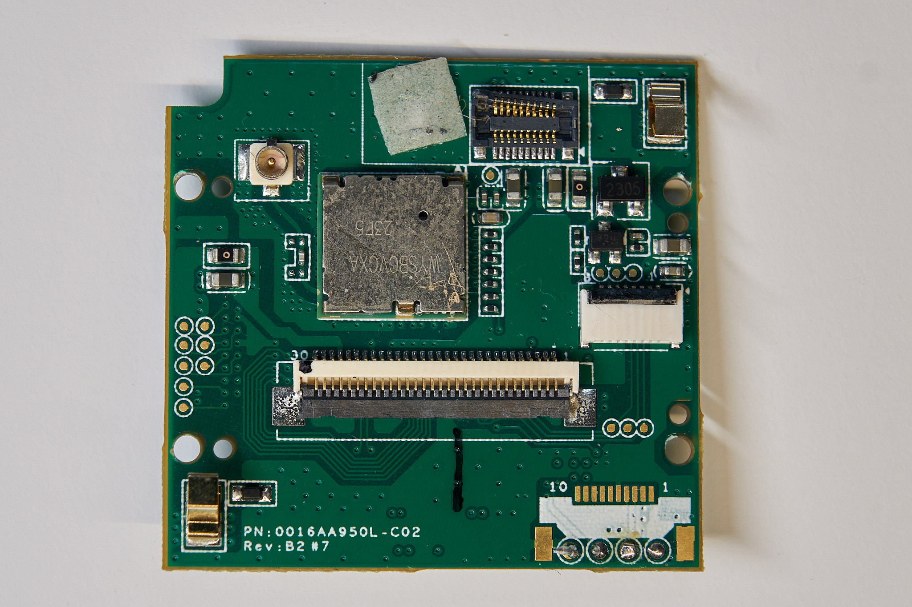

Finally, the last board connects to the display as well as the capacitive touch sensor that controls zoom. It is on this board that we find a peculiar looking  unpopulated connector pad. Basic testing quickly reveals UART pins like shown, but all we get is a short boot message and no input or echo…

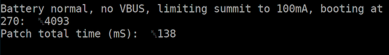


Lets make a nice breakout of those pins for later use just in case. 

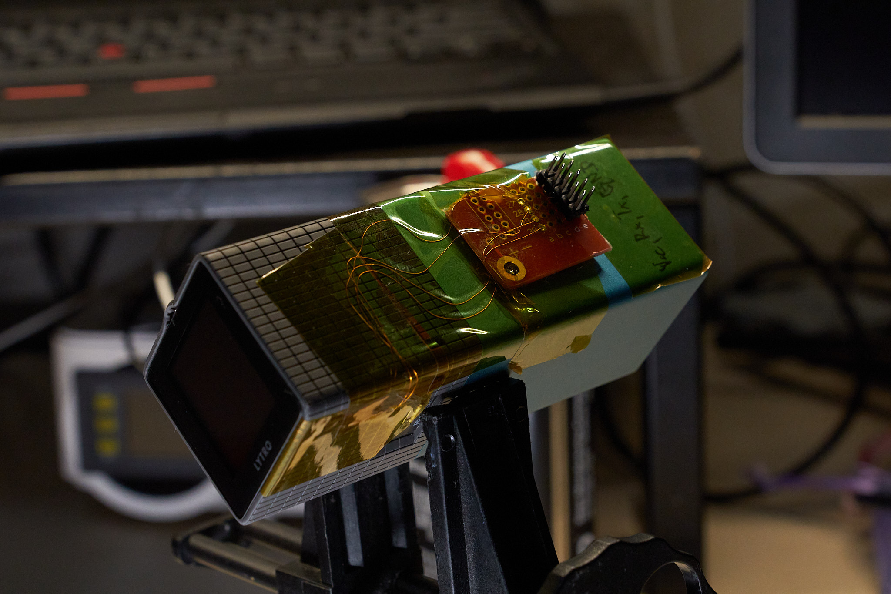

## The firmware

So we have a serial port, but it doesn’t give us anything useful (yet!).  Let’s check out the firmware to see if we should even expect anything on the serial output. 
Luckily for us, "Lytro Meltdown" has archived all the public firmware versions at : http://optics.miloush.net/lytro/TheResources.aspx

Firmware update seems to be complete and not incremental, which is a good thing. It starts with a simple JSON text that describes the actual data that follows. It appears that the firmware is just flat memory contents whithout any disernable file system. Binwalk reveals the following:

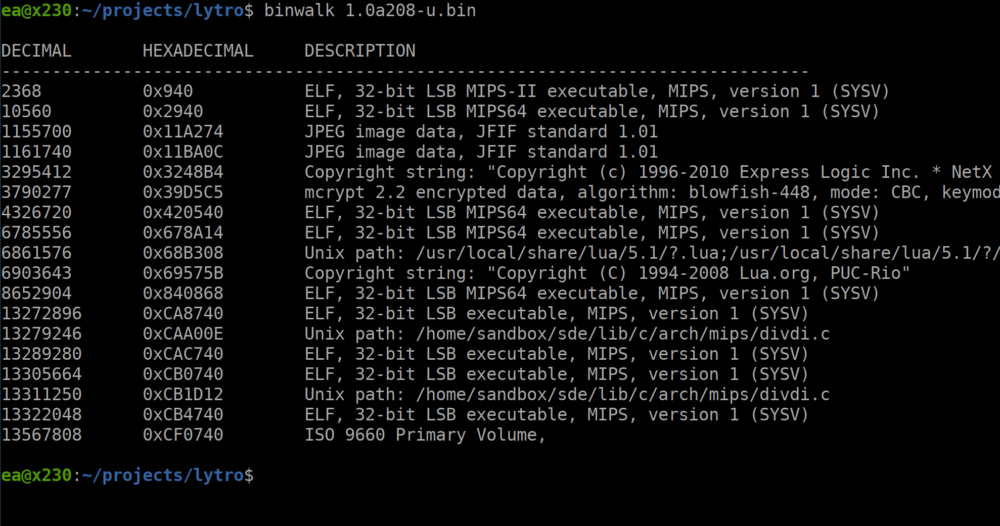

Remember, ELF files don’t imply that we are dealing with Linux. And indeed, in this case, ELF format is used for memory mapping and binary loading purposes. All the binaries seem to be mapped to their respective addresses and cross-reference each other. 
```
$ readelf -a 2A0540.so
ELF Header:
  Magic:   7f 45 4c 46 01 01 01 00 00 00 00 00 00 00 00 00
  Class:                             ELF32
  Data:                              2's complement, little endian
  Version:                           1 (current)
  OS/ABI:                            UNIX - System V
  ABI Version:                       0
  Type:                              EXEC (Executable file)
  Machine:                           MIPS R3000
  Version:                           0x1
  Entry point address:               0x80000608
  Start of program headers:          52 (bytes into file)
  Start of section headers:          0 (bytes into file)
  Flags:                             0x70001001, noreorder, o32, mips32r2
  Size of this header:               52 (bytes)
  Size of program headers:           32 (bytes)
  Number of program headers:         1
  Size of section headers:           40 (bytes)
  Number of section headers:         0
  Section header string table index: 12 <corrupt: out of range>

There are no sections in this file.

There are no sections to group in this file.

Program Headers:
  Type           Offset   VirtAddr   PhysAddr   FileSiz MemSiz  Flg Align
  LOAD           0x000054 0x8028e280 0x8028e280 0x134000 0x134000 RWE 0x8

There is no dynamic section in this file.

There are no relocations in this file.

The decoding of unwind sections for machine type MIPS R3000 is not currently supported.

Dynamic symbol information is not available for displaying symbols.

No version information found in this file.
```
The whole firmware seems to be based around an unknown real-time operating system. 

Even though we don’t know the exact size of the binaries, we can assume they are contiguous in memory and just extract the maximum possible size. That gives us the following ELF files: 

```
2940.so:   ELF 32-bit LSB executable, MIPS, MIPS32 rel2 version 1 (SYSV), statically linked, no section header
2A0540.so: ELF 32-bit LSB executable, MIPS, MIPS32 rel2 version 1 (SYSV), statically linked, no section header
3D4594.so: ELF 32-bit LSB executable, MIPS, MIPS32 rel2 version 1 (SYSV), statically linked, no section header
5F6C68.so: ELF 32-bit LSB executable, MIPS, MIPS32 rel2 version 1 (SYSV), statically linked, no section header
63DB40.so: ELF 32-bit LSB executable, MIPS, MIPS32 version 1 (SYSV), statically linked, not stripped
641B40.so: ELF 32-bit LSB executable, MIPS, MIPS32 version 1 (SYSV), statically linked, not stripped
645B40.so: ELF 32-bit LSB executable, MIPS, MIPS32 version 1 (SYSV), statically linked, not stripped
649B40.so: ELF 32-bit LSB executable, MIPS, MIPS32 version 1 (SYSV), statically linked, not stripped
940.so:    ELF 32-bit LSB executable, MIPS, MIPS-II version 1 (SYSV), statically linked, stripped
```

Examining the first one reveals what appears to be a bootloader, or at least a stage of it. We can see the same strings we observed in UART output. 

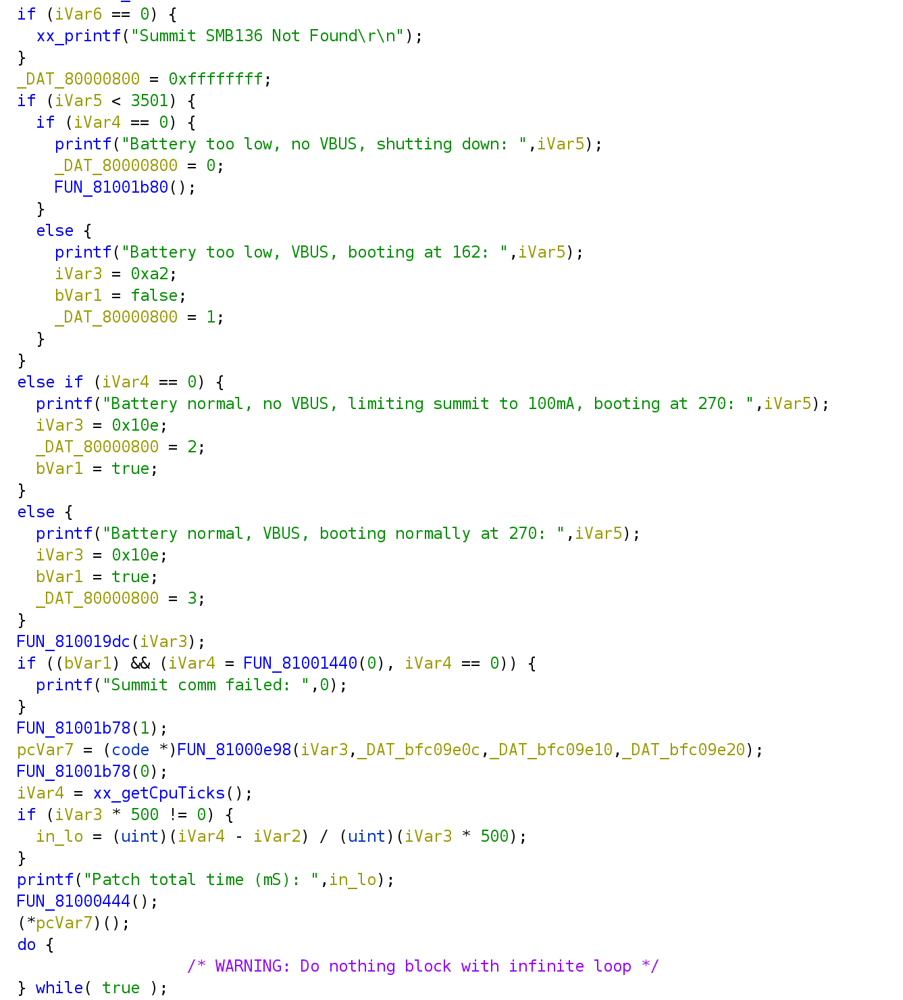

Binaries that follow are bigger and appear to contain a lot more functionality.

Randomly stumbling through the strings in `2A0540` reveals the following:

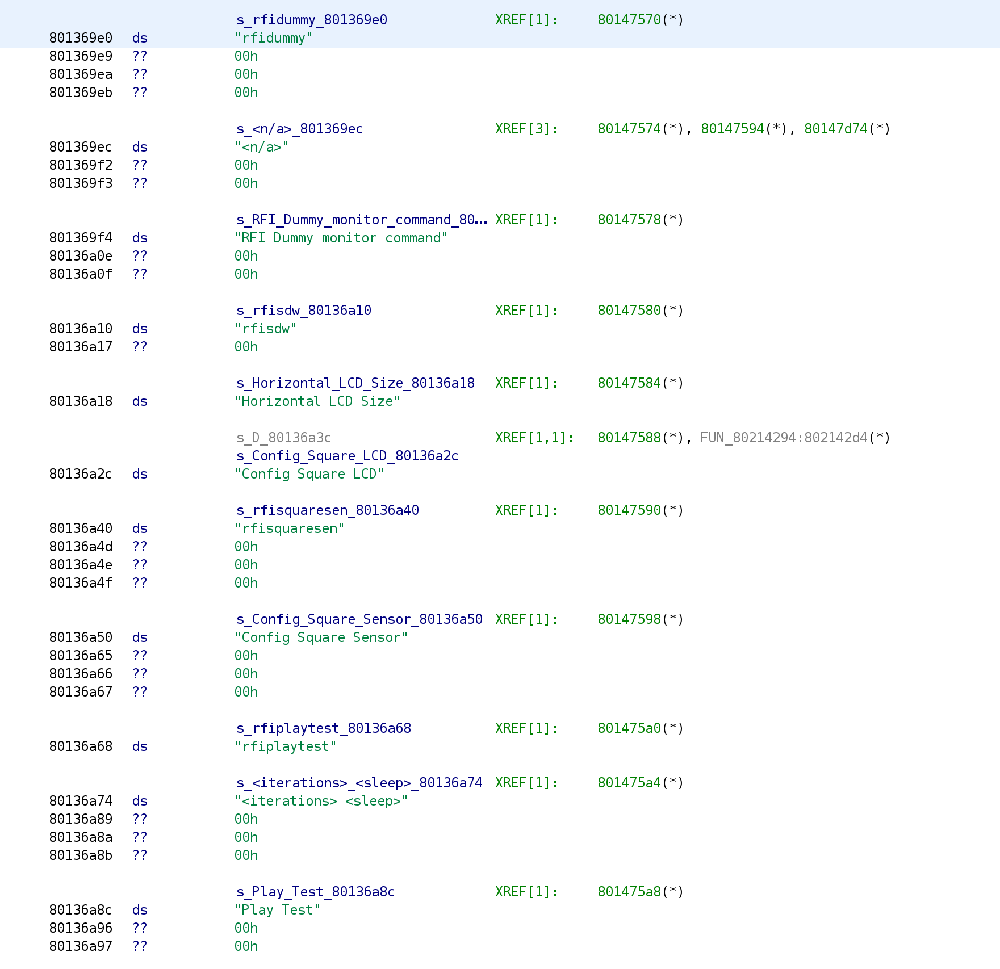

This definitely appears to be some sort of command palette with command names, descriptions and associated target functions. This is great news! Already I can see some that look very interesting. The question is, how do we get to them? Remeber, no response over UART.

## Interfaces

With UART unresponsive, but encouraged by what we saw in the firmware, we turn to other was of interacting with the camera. That is, USB and WiFi. 

Again, thanks to <LyTRO Meltdown> docs, we have a pretty good start when it comes to wifi communication. Similarly, from Lyli project, we can see that WiFi communication is actually based on USB protocol and mostly follows the same protocol. Only that USB is actually based around SCSI commands, while WiFi is direct over TCP/IP. 
Lytro meltdown doccuments the following set of commands:
  
- load hardware info (`C2 00 00`)
- load file (`C2 00 01`)
- load picture list (`C2 00 02`)
- load picture (`C2 00 05`)
- load calibration data (`C2 00 06`)
- load compressed raw picture (`C2 00 07`)
- download command (`C4 00`)
- query command (`C6 00`)
- query camera time (`C6 00 03`)
- query battery level (`C6 00 06`)
- take a picture (`C0 00 00`)
- set camera time (`C0 00 04`)

  
Some of these look incomplete and I am willing to bet there are more so our next step is to go back to the firmware to try to find where these are being processed. 

## Command interpreter - Finding our way around

Now we are faced with a conundrum. We have this giant piece of code, all of these binaries from the firmware, and we want to find the small chunk of code that’s parsing incoming Wifi or USB data in order to locate the code that corresponds to commands observed from official software. 

This is a common problem in reverse engineering that I like to call localization. It’s much harder to figure out what the code does without knowing the context it’s being executed in. This can often be simply solved with a debugger, but in this case we don’t have such luxury. 

Unusual or rare constants are a reverser’s friend. Those can be unique cryptographic IVs, but also something much less exotic. Consider that there are 3600 seconds in an hour. That seems like a round number in decimal, but is a somewhat unusual looking constant in hex. As such, there’s a chance it will be somewhat rare in the binary you are looking at. 

On the other hand, SetTime command from above expects camera time in a very specific format. We can guess that at some point during its execution, it would need to convert seconds to hours or vice versa. Searching for seconds-in-hour (3600 or 0xe10)constant in the binary reveals only a handful of locations which we can manually investigate. And sure enough, one of them definitely look like time/date formatting code. 

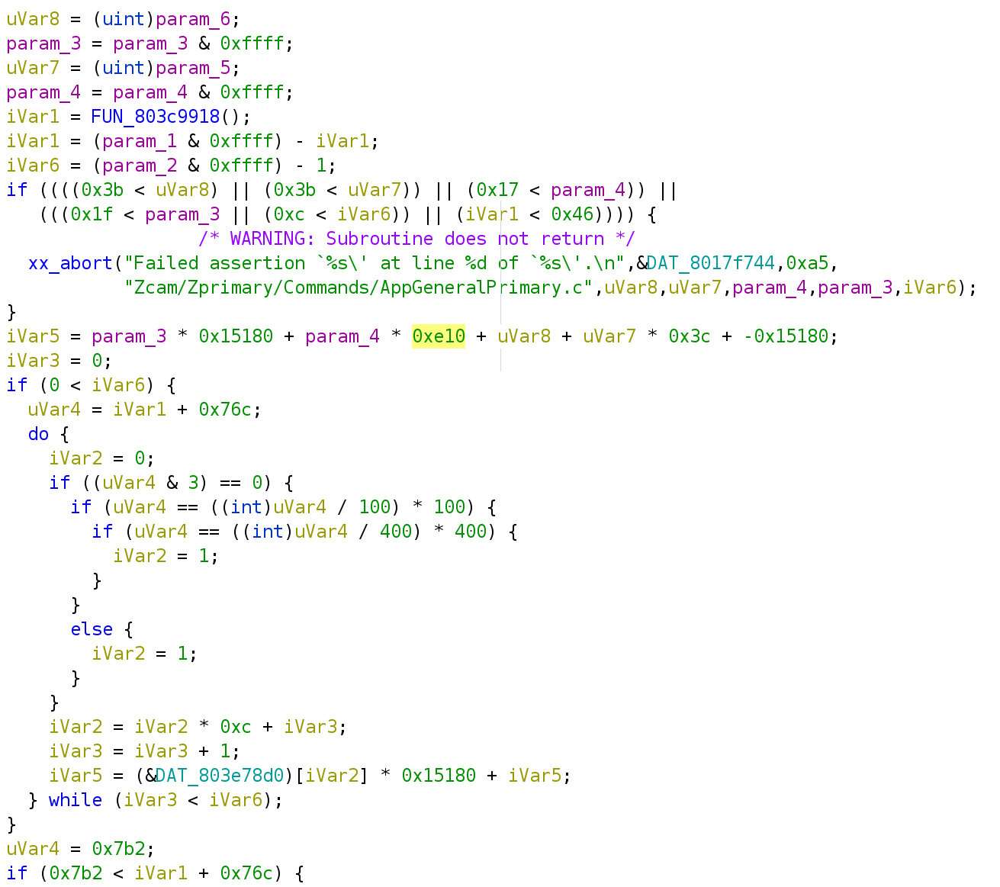
 
Backtracking through references quickly leads us to code that looks awfully like what we’d expect a command interpreter to look like. A series of switch statements with command handlers. 

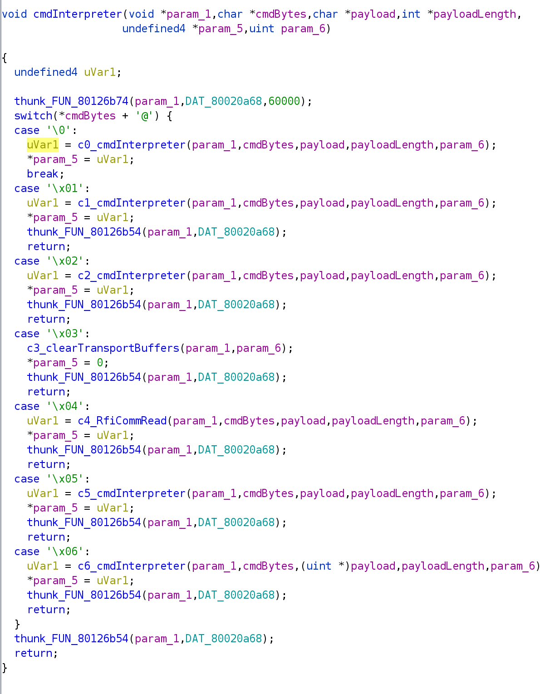

 
Success! Now we have our bearing in the firmware and can start exploring and make guesses about functionality with more confidence. 

## Command classes, commands and payloads

All in all, by studying the command interpreter code we can deduce the following (mostly) complete set of commands. All of them match with what was previously documented and observed, and there’s quite a few hidden an unknown ones:
  
```python
class CommandClass(Enum):
	CMD_CTRL = 0xC0
	CMD_FW = 0xC1
	CMD_LOAD = 0xC2
	CMD_CLR = 0xC3
	CMD_READ = 0xC4
	CMD_FW_UP = 0xC5
	CMD_QUERY = 0xC6


class CtrlCmd(Enum):
	CMD_CLASS = CommandClass.CMD_CTRL
	TAKE_PHOTO = 0x00
	DELETE = 0x01
	UPDATE_FW = 0x02
	REBOOT = 0x03
	SET_TIME = 0x04
	UNK1 = 0x05 # something with files
	UNK2 = 0x06 # delete all ? 
	SET_SHARE_MODE_SSID = 0x07
	SET_SYNC_MODE_SSID = 0x08
	SET_SHARE_MODE_PASS = 0x09
	SET_SYNC_MODE_PASS = 0x0A
	SET_SHARE_MODE_AUTH = 0x0B
	MANUAL_CTRL = 0x0C
	WIFI_OFF = 0x0D
	INJECT_UART = 0xFE
	EXEC_CMD = 0xFF

class FwCmd(Enum):
	CMD_CLASS = CommandClass.CMD_FW
	SET_FW_SIZE = 0x00

class LoadCmd(Enum):
	CMD_CLASS = CommandClass.CMD_LOAD
	CAMERA_INFO = 0x00
	FILE = 0x01
	PHOTO_LIST = 0x02
	UNK1 = 0x03
	UNUSED = 0x04
	PHOTO = 0x05
	CALLIBRATION = 0x06
	RAW  = 0x0a
	CRASHES = 0x0b

class ClearCmd(Enum):
	CMD_CLASS = CommandClass.CMD_CLR
	CLEAR_BUFFERS = 0x00

class ReadCmd(Enum):
	CMD_CLASS = CommandClass.CMD_READ
	READ = 0x00

class FirmwareUploadCmd(Enum):
	CMD_CLASS = CommandClass.CMD_FW_UP
	UPLOAD_CHUNK = 0x00

class QueryCmd(Enum):
	CMD_CLASS = CommandClass.CMD_QUERY
	CONTENT_LENGTH = 0x00
	UNK1 = 0x01
	READ_UART = 0x02
	CAMERA_TIME = 0x03
	RECOVER_CALLIBRATION  = 0x04
	READ_GLOB_80020a60 = 0x05
	BATTERY = 0x06
	SETTINGS = 0x0A
```

That's quite a lot of extra functionality reachable over USB or WIFI! Most are self explanatory, but some I am yet to explore. However, we aren't done yet. Remeber that UART is still locked.

## Secret Unlock command

You’ll notice in the above that I’ve listed an EXEC command. It was an obvious choice to focus on and try to figure out. At first, it looked like it just expects a string to run as command, but it simply wouldn't work. Digging deeper into it revealed something interesting. It first caught my attention because it’s clearly doing something with SHA1. That has to be something interesting!After cleaning up the decompiled code, the functionality becomes obvious.
  


  
The function takes some string from the memory, concatenates “ please” to it and calculates a SHA1 hash of it. Then it compares that hash to whatever was received as payload. 
  
After a bit more  digging, it becomes obvious that the string in memory is actually the serial number of the camera. We can easily get the serial number, so let’s calculate the expected hash, send it and see what happens:

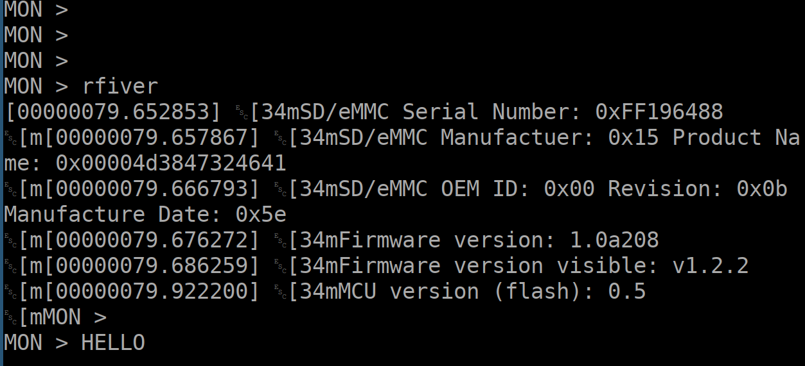

Well, looks like that takes care of the locked serial console. In addition to unlocking the serial output, this enables command execution and a lot of other functionality. It turns out that a good number of above commands were checking this global variable before being run. Sending the correct hash sets the variable and enables the locked commands. Thanks Lytro for not making it too complex!


## Commands over Wifi

Full list of commands is quoted above. Not all of them have been fully implemented in the accompanying software yet. If you find it useful, feel free to make a pull request. 

To test it out, enable WiFi on the lytro camera and connect to it. Then run one or more samples from [lytroctrl](https://github.com/ea/lytroctrl) examples.

Some of the commands are more complex than others and some even have subcommands of their own. 
 - Wifi Settings
  
	Looks like two modes are supported, the AP mode that is the default, and “sync” mode where the camera connects to the specified access point. The second mode would probably be a lot more convenient to use, but I haven’t yet found a way to persist these particular settings across reboots. 
 - Live View 
  
	Parameters are enable/disable, compression ratio and FPS specification. When Live View is enabled, a new thread is started on the camera that simply sends JPEG frames over multicast UDP <insert address and port>. These can easily be captured by ffmpeg for example: `ffmpeg -i 'udp://224.0.0.100:10101?&localaddr=10.100.1.100' -vcodec copy output.mp4`. It’s a bit unstable, and care should be taken when choosing the parameters. Check out the `LiveView.py` script in [lytroctrl](https://github.com/ea/lytroctrl)

 - Manual Controls
  
	Live View above is actually implemented as a subcommand to manual control command. Subcommands are as follows : 
    - enable manual controls
    - set creative mode
    - control nd filter
    - set zoom level
    - set exposure
    - set sensor gain
    - enable live view
 - Command Exec and Serial Sync
	
  As shown previously, the firmware has a sort of command shell which can be accessed thought serial console.  It turns out that we can send commands to it directly through CmdExec command. Similarly, we can read the serial output buffer via SerialSync command. This enables implementing a simple shell over wifi. Check out the `shell.py` script in [lytroctrl](https://github.com/ea/lytroctrl) to see how it works. 

### Built-in shell

With ability to unlock the camera over wifi, and with combined ExecCmd and SerialSync commands there’s no need to open the camera or do any physical modifications in order to explore the built in shell. The following is the complete list of commands with their associated descriptions:

```

!hist -- list <num entries> last commands
!histcfg -- config history size (32..1024 / 80..256). <stat> for status
!color -- echo each entered cmd with color. no entry disables echo mode
!histlog -- log the history and restore if possible after reboot
!list -- list all available commands or <list index>
!listhelp -- list all available commands that their help string contains 'keyword'
!prompt -- change monitor prompt (see extended help). give no args to restore default
!acclines -- starts / add to / list print / raw print line accumulation mode (none to reset)
!evalfmt -- configures the expression eval output format modes
!dumpstack -- dumps the symbols of the current active (line acc.) threads stack dump
!script -- create (or remove) a script. source can be line acc. or 1 line or history range
!memcli -- gets the monitor (cli) current memory usage
!vercli -- displays the monitor (cli) current release info (version + date)
!quit -- quits the monitor command
+ -- repeat last <entries count> <count> times
: -- edit history <entry index> if exists (1-based). 0 is synonym for last entry
= -- evaluates the expression. use 'ans' to sign the previous result
help -- Prints function help
ls -- Prints all avaliable functions help
prompt -- Set new prompt
repeat -- Repeate a cmd command num times with a delay between (ms)
# -- Comment - everything is ignored
// -- Comment - everything is ignored (deprecated in new CLI)
reprintcrash -- Reprint the crash that triggered debug console
dumpall -- Reprint the crash dump
crash -- Force the system to crash (for debug!)
mfc0 -- Get a coprocessor 0 register
set_media -- Choose media types
smed -- Choose media types
format -- Format a media
mount -- Mount a media
mountx -- Mount a media
mountdram -- Create and Mount Dram media
flush -- Flush the media
gms -- Get media status
goms -- Get Other media status
delall -- Delete all DCF objects
delete -- Delete an object
lock -- Lock an object
unlock -- Unlock an object
copy -- Copy an object
move -- Move an object
copyto -- Copy an object to another drive
dcfdump -- DCF dump
dcfdumpraw -- DCF dump - raw
dcfdumpobj -- DCF dump - objects
dcfdumpobjindex -- Dump DCF object
cfread --
ideread --
ataread --
sdread --
msread --
ssfdcread --
nandread --
nandreadp --
nandnsread --
nandnsreadp --
noraread --
noriread --
cd -- Change directory
cdc -- Change dir to first DCF folder
dir -- List directory's contents
ren -- Renames a file/directory
mkdir -- Create a directory
del -- Delete a file/directory
cfflush -- Flushes contents into file
msflush -- Flushes contents into file
msflushp -- Flushes physical contents into file
nandflush -- Flushes contents into file
nandnsrflush -- Flushes contents into file
burstmode -- Switches read operations mode
msextra -- Flushes extra bytes into file
nandextra -- Flushes extra bytes into file
ssfdcextra -- Flushes extra bytes into file
cferase -- Erase CF sectors
nanderase -- Erase the whole Nand media
ssfdcerase -- Erase the whole SSFDC media
norerase -- Erase the whole Nor media
ssfdcreadp -- Read physical sectors
ssfdcwritep -- Write physical sectors
nandwritep -- Write physical sectors
ssfdcreset -- Reset SSFDC
msreadp -- Read physical sectors
norreadp -- Read physical sectors
sdwrite -- Write sectors
cfwrite -- Write sectors
atawrite -- Write sectors
atadma -- Enable/Disable uDma mode
nandimg -- Burn image file as-is to nand
fcuram -- Print the content of the DMA ram
sdblen -- Set SD Block Length for R/W commands
msleep -- Switch media to Sleep mode
getmattr -- Returns attribute of current media (I43_GetMediaAttr)
mretry -- Retry Mechanism configuration
mreset -- Reset media
mserial -- Switch media to Serial/Parallel mode
merase -- Erase Num Sectors from media
msetibd -- Set IBD by dummy data
mgetibd -- Get IBD
setfat -- Set FAT format type
mspeedtest -- Check average media speed (NAND/MS/SD)
mdirect -- DirectMediaAccess
mparam -- DirectGetMediaParam
flashdump -- Dump resident flash content
cr -- Set compression ratio
ei -- Edit Image
getexp -- Get exposure/gain
setexp -- Set current exposure
wbs -- Set WB scalers
wbg -- Get WB scalers
wbm -- Set AWB mode
aem -- Set AE mode
afwinget -- Get window AF values
afwinset -- Set window AF dimensions
wbcalib --
stat -- Set statistics pattern
statdebug -- Print statistics on/off
algtime -- Print algorithms time statistics
aecfg -- Set AE configuration
wdi_timer_on_cop -- test wdi timer on cop
dump_log_wdi_timer -- dump logs from test wdi timer on cop
read -- run lsc calibration
lsccal -- run lsc calibration
lsccshc -- run lsc & csh calibration with captured frame
lsccsh -- run lsc & csh calibration with source file
ca -- MonitorSetIpuCa
lsc -- MonitorLsc12
csh -- Read back the CSH config resource data
mixf -- Test iMix for smear purposes
mixd -- Test iMix for dblemishes purposes
smearsim -- Run smear simulator (read raw input from sd card)
smear -- Control current instance of smear
mixd -- Test iMix for dblemishes purposes
dblemish -- control dark blemishes reduction filter api
dblemish_test --
dblemish_testi --
forcedc -- Force DC creation in preview mode
vscale -- Test IPU Bayer VScaler
anr -- Configure ANR for a given mode
previewFps -- Print display frame rate
dist -- enable disable dist
rg -- Read 16bit GPP RAM address
fc -- Call a function
sum -- I43_SetUsbMode
hqd -- Host queue dump
hlqd -- Host log queue dump
setp -- Set parameter
getp -- Get parameter
mode -- Set functional mode
reboot -- Reboot using given boot configuration
modeconf -- Select mode configuration
cc -- I43_ConfigCapture
cm -- I43_ConfigMovie
cp -- I43_ConfigPreview
playerdump -- Dump player info
getsr -- Dump status registers Sr1 & Sr2
cgut -- Dump CGU table
mips -- Get available MIPS
mipscop -- Get available MIPS
cpu -- Print CPU load statistics
ver -- Get version number
prof -- Profiling tool
cmdcr -- Command file create
cmdex -- Command file execute
delay -- Delay in ms (in a command file)
sci -- I43_SetCurrentImage
gci -- I43_GetCurrentImage
gcii -- I43_GetCurrentDirImage
wav -- Play Wav file
mp3 -- Play MP3 file
ccc -- I43_CaptureClipCommand
pcc -- I43_PlaybackClipCommand
mpeg4 -- Switch to MPEG4 video
mp4 -- Switch to MPEG4 video with AAC audio
h264 -- Switch to H264 video
tape -- TapeRecorder
le -- Print the last error number
photoframe -- Add photo-frame to captured images
ptpdumpdb --
rrs -- Read Register Shadow
wrs -- Write Register Shadow
c2ccalib -- C2C calibration
imagesize -- Set image size
timing --
rfstest -- Test read File
wfstest -- Test write File
g -- Start PWR consumption prints
cgucfgen -- Configure and Enable Clock
cguop -- get/ set cgu clocks
cguoptest -- Test cguop
cgudis -- Disable Clock
rosc -- Get CGU ring oscillator counters
tlb --
rsgop -- Set gop size of recorded clips
rsmaxb -- Set max b frames of recorded clips
mtmstart -- Initialize timing mark of movie group
mtmstop -- Dumps timing mark of movie group
pwrtime -- Time power state for <ms>,dump results to <fileName>
addmulticonfig -- Add configuration for Usb multi mode
fdprepare -- Prepare preview for face detection
fd -- Enable/Disable/TestMode face detection
fdps -- set fd profile
fdpg -- get fd profile
fdtmstart -- Initialize timing mark of FDTA group
fdtmstop -- Dumps timing mark of FDTA group
fdd -- Dumps timing mark of FDTA group
md5sum -- Calculate and print the md5 sum <size> bytes at <addr>
md5file -- Calculate and print the md5 sum of the contents of <filename>
shmoo -- ddr calibration
shmoom -- ddr calibration
ddr3 -- ddr3
testpip -- TestHWPIP
dimix_a16b -- Test DirectImageMix add 16 bit
dimix_c16b -- Test DirectImageMixEx copy 16bit
mix16 -- test 16 bit blending with IMix
mix8 -- test 8 bit blending with IMix
imixpd --
imixlut -- Test IMIX blending with alpha LUT
gpioset -- Output to GPIO
gpioget -- Input/Read from GPIO
fd2log -- fdta2 batch log
sym -- Find Symbol from Address
dis -- Disassemble MIPS code
tfload --
tfconfig --
tfenable --
nr12 -- Activate C12 NR
nr13 -- Activate C13 NR
zl12 -- Activate C12 ZLIGHT
zl13 -- Activate C12 ZLIGHT
scrd -- save capture RAW/YUY
sprd -- save preview RAW/YUY
srrd -- save direct movie Rec/Play RAW/YUY
perfdump -- Print all messages for groups
perfverb -- Change the Performance Verbosity Level
perfinit -- Init Performance logging groups
perfprint -- Call Print Function on groups
dsyuv -- Saves AVI frame# to JPEG with given out format
otprepare -- Prepare preview for object tracking
ot -- Enable/Disable object tracking
ddrtest -- Start DDR test
ippg -- Print the input numbers
videmu --
rer -- Configure Capture RER
stillfd -- Configure still FD
eefilter -- set ee filter
testvec -- test Vector font feature
testgvec -- test graphic Vector font feature
test8vec -- test OSD8 Vector font feature
dhry -- run dhrystone
stabmode -- Stabilizer mode (before entering recording!)
dvsenable -- Enable/disbale DVS filter
dvsconfig -- Configure DVS
dvslogtransforms -- Logs each bounding box and transform as it is received from DVS
dvslogapis -- Logs each DvsFlowProxy API call
dvslogmvs -- Logs DVS motion vectors for debugging purposes
dvslogstats -- Logs DVS statistics for debugging purposes
dvsgenboundingbox -- Enable/disable creation of DVS bounding boxes
dvsgentransforms -- Enable/disable creation of DVS transforms
dvsoverboundingbox -- Override DVS bounding box for debugging purposes
dvsovertrans -- Override DVS transform for debugging purposes
dvsenablehighload -- Enable/disable high load for DVS
dvsarcstop -- Stop the arc
rfd -- FDTA in rec
cbcmode -- cbc activation on video
icacop -- ICA translator on COP
icatrans -- ICA translator on COP
saveipfilters -- Dumps filters to binary file
loadipfilters -- Loads filters from a binary file
disableipfilters -- Clear filters(mode or all)
enableipfilters -- Enables filters(mode or all)
reportipfilters -- Reports all filters
copyipfilters -- Copy filters from one mode to another
altcodecopy -- Enable/Disable imix code copy
setssm -- set sensor submode
jtag -- Enable JTAG for Main CPU (mips), COP CPU (cop) or ARC CPU (arc) or Main & COP CPUs (mips-cop) or Main, COP & ARC CPUs (
syscheckaccuracy -- Set SysCheck thread accuracy (0 to disable)
passistcr -- Creates Panorama Assist
passistds -- Destroys Panorama Assist
mawb -- AWB configuration
ipslsc -- IPS LSC test
hfr -- Creates HFR specific configuration
playhisto1 -- MonitorHistogram
playhisto2 -- MonitorTestSoftwareHistogram
custom -- Print the input numbers
typer -- Thresholds for typer
typerdebug -- Debug prints for typer
sdioi -- SDIO card init 1BIT/4BIT
sdiori -- SDIO card read info
sdiorc -- SDIO card read common CIS
sdiosb -- SDIO card switch bus width
sdiowr -- SDIO card write register
sdiorr -- SDIO card read register
sdiowm -- SDIO write multi bytes
sdiorm -- SDIO read multi bytes
sdiowmb -- SDIO write multi blocks
sdiormb -- SDIO read multi blocks
sdioset -- SDIO read set block size
sdioget -- SDIO read get block size
sdiow -- SDIO wait interrupt
rfidummy -- RFI Dummy monitor command
rfisdw -- Config Square LCD
rfisquaresen -- Config Square Sensor
rfiplaytest -- Play Test
rfigetpa -- GetParamArray
rfitaptoae -- Tap to Ae
rficaptureold -- Captura an image
rfidcfdump -- List all DCF contents
rfidemodseq -- Capture image sequence for demodulation
rfierror -- Print the last Rfi error that occurred
rfiipucfg -- Enable or disable a specific IPU filtering pass
rfiipuclobber -- Start an infinite loop that clobbers the IPU
rfijpegquality -- Set the JPEG compression mode (quality)
rfiprint -- Print a message to the console
rfitrace -- Dump the thread stack traces to the console
rfiver -- Print the firmware version information
rfiprofile -- Profiles the processor using some simple loops
rfisfc -- Calls FC with a state
rfilayershow -- Layer Show
rfitimers -- Enables/disables timer printouts
rfilogstart -- Starts RFI timing system
rfilogstop -- Stops RFI timing system
rfigsiu -- Runs GSIU 2Wire test
rfi7260 -- Initialize ITE 7260
rfisendump -- Dump Aptina 14M registers to UART
rfisenscan -- Uses Aptina test pattern to scan through colors
rfipwr -- Control PWR17
rfisenwr -- Send value to Aptina 14MP over I2C
rfisenrd -- Read value from Aptina 14MP over I2C
rfiitewr -- Send value to Ite7269 over I2C
rfiiterd -- Read value from Ite7260 over I2C
rfitamron -- Tell the tamron lens what to do
rfiiq -- Tweak image quality parameters
rficapture -- Capture an image
rfiosdtest -- Displays OSD test pattern
rfirawtests -- Encodes a 16bpp RGGB raw image in different ways
rfilua -- Enters the Lua console, or runs the script if given
rfilua2 -- Runs the given script in the monitor thread
rfilua3 -- Runs the given chunk in the lua thread
rfiluagui -- Enters Lua and runs the menu.lua script
rfimd5test -- Run MD5 performance test
rfilcdcmd --
rfimain -- Advances RFI main to a stage
rfisentest -- Sensor test
rfishuttest -- Shutter test
rfimediatest -- Various media tests
rfical -- Run the camera per-unit calibration
rfimode90loop -- Loops
rfilcded -- Sets ED mode
rfiviewmenutest -- Tests/demos the view menu
rfibat -- Measure battery voltage
rfibatcsv -- Measure battery voltage/current/percent, temperature (C/adc), time
rfibatrf -- Read gas gauge flash memory
rfibatwf -- Write byte gas gauge flash memory
rfibatwritedfi -- Write gas gauge data flash image
rficharger -- Read/Write charger IC registers
rfiemergencypower -- Override emergency power parameters
rfigain -- Set capture gain
rfiexp -- Set capture exposure
rfind -- Set ND filter override
rfibipos -- Enable/Disable biposition
rficomraw -- Enable/Disable saving compressed raw images
rfiaccel -- Read accelerometer state
rfimotortest -- Perform lens motor/positioning test
rfijpegtest -- Load and then save the most-recent DCF image
rfiers -- Switches between ERS and mechanical shutter
rfipwm -- Controls the COACH PWM
rfiaesweep -- Enables/Disabled AE sweep test
rfiwdi -- Enables/Disables watchdog
rfipngtest -- Tests loading an ARGB image from a PNG
rfifwup -- Upgrades from a file
rfimsct -- Sets mechanical shutter closing time in us
rfiidle -- Can be used to disable the idle timeout
rfiadc -- Reads RAW ADC value
rfideldcf -- Deletes all DCF images
rfiopenfiles -- Lists open files
rfievcomp -- Sets exposure compensation
rfiusb -- Camera USB Mode control
rfisenid -- Prints the FuseID of the Aptina sensor
rfilenslambda -- Run lens calibration routine to measure lambda
rfilensconv -- Convert lens calibration file
rfidemosaicinfo -- Print demosaic parameter
rfidemosaic -- Perform demosaic test
rfitestuart -- Perform firefly UART client test
rfisettings -- Print the settings DB matching substr to the console
rficsi2ctgl -- Perform a toggling of I2C pins for CS/TS
rficop -- Run monitor command on COP
rfimcutest -- Run the MCU Spy-Bi-Wire test
rfimcudump -- Dump MCU memory
rfimcuflash -- Flash MCU
rfisettimestamp -- Set TimeStamp to COACH RTC
rfigettimestamp -- Prints time stamp from COACH RTC
rfisetaeparam -- Set the AE parameters
rfiset16to1agg -- Turn on/off the aggregation of 16 raw captures
rfidarkframe -- Enable dark frame
rfireboot -- Reboot the camera
rfireboottolowbat -- Reboot the camera to low battery mode
rficat -- Meow :-)
rfitestspill -- Tests enabling/disabling small pool spill over
rfiipsmax -- Tests finding max value using IPS
rfiimix -- Tests for IMIX
rfiipu -- Tests for IPU
rfidumpae -- Dumps COACH AE parameters
rfilam -- Enqueue fake AF result for PB refocusing
rfisetsetting -- Set setting (type can be anything)
rfigetsetting -- Get setting (type can be anything)
rfisetsettingex -- Set setting
rfigetsettingex -- Get setting
rfiresetsetting -- Reset setting to default
rfisetstate -- Set state setting
rfipopup -- Insert an event that will cause a popup warning
rfiviewiq -- View image quality test code
rfifsck -- Runs FSCK
rfimcusetserno -- Set camera serial number
rfidumpsernos -- Dump serial number files
rfimcutestalive -- Test that MCU is alive
rfimcutestpin -- Test MCU pin state
rfirenesas -- Dump Renesas register shadow
rficleanup -- Cleanup camera before shipping to end-users
rficheckcam -- Pre-ship check of camera state/contents
rfisil -- Sets infinity target lambda
rfigil -- Gets infinity target lambda
rfiinspectuihist -- Dump history of UI mode transitions
rfiinject -- Injects event into camera for QA/test/debugging
rfidebugcolor -- Debugging function for on-camera IQ
rfiunbrick -- Remove the camera bricked flag
rfiprotect -- Drive WP
rfipcbver -- Get PCB revisions
wifi -- Main entry point For embWiSe WIFI
rfiwifimode -- With no arguments, display wifi mode; with an argument, set it
rl -- Read 32 bit address
wl -- Write 32 bit address
mf -- Fill memory with a value
rv -- Read a variable value or array index
wv -- Write a variable value or array index
dump -- Dump memory to screen
dumpx -- Dump DRAM to screen. Hex Input
dumpf -- Dump memory to file
dramsize -- Print dram size
mi -- Get Max Alloc Size
mt -- Dump Alloc table
mxt -- Dump pool structure
mls -- Dump list of pools
ldstart -- Start leak detection
ldstop -- Dump leaks
hmpp -- Hardware memory protection (physical address)
hmpoff -- Turn off hardware memory protection. 0: main (default), 1: secondary.
dmstat -- directmovie memory usage statistics
hmpstat -- Check state of hardware memory protection
npon -- Enable null protection
npoff -- Disable null protection
ttcop -- Dump thread table
tt2cop -- Take snapshot of the thread table
tcresetcop -- Reset thread counters
txtcop -- Dump threadX table
tmrtcop -- Dump timer table
qtcop -- Dump queue table
qicop -- Dump queue info
etcop -- Dump events table
smtcop -- Dump mutex and semaphore table
isrtcop -- Dump ISRs tables on COP
isrt2cop -- Take snapshot of isr table, print and reset stats
top -- Display thread performace table
tt -- Dump thread table
tt2 -- Take snapshot of the thread table
tcreset -- Reset thread counters
txt -- Dump threadX table
tmrt -- Dump timer table
qt -- Dump queue table
ipcqt -- Dump IPC queue table
ipcqreset -- Reset IPC queue counters
qi -- Dump queue info
ipcqi -- Dump IPC queue info
et -- Dump events table
smt -- Dump mutex and semaphore table
isrt -- Dump ISRs table
isrt2 -- Take snapshot of isr table, print and reset stats
csw -- Context switch logging
configpack -- Save config pack data
loadipu -- Load and run ipu path
siit -- MonitorItSubimages
ipucfg -- Set IPU CFG filter
sleep -- Bring camera to sleep mode: 0-normal 1-deep.
rtc --
rtcset -- Set internal Real-Time-Clock and activate it
rtcget -- Print internal Real-Time-Clock.
default format: hhmmss
if param 1 is given, format is: YYYYMMDDhhmmss

rtcset_timeout -- Set RTC timeout.
rtcget_timeout -- Get RTC timeout, in hex: 0xFFFFFFFF.
rtcset_inforeg -- Set RTC inforeg.
rtcget_inforeg -- Get RTC inforeg, in hex: 0xFFFFFFFF.
```
	
Some of these are pretty interesting. Some I haven't yet come around to figure our (there seems to be a panorama mode!). Here's some of the highlights
 - `rfitamron`
	Gives full control over the lens. This one actually has a few "undocumented" subcommands that enable precise focus control, autofocus activation , zoom and everything that has anything to do with the lens (I guess the name reveals who was the manufacturer of the lens, Tamron is a well known brand). 
    - `rfisettings`
	All the camera settings can be read by issuing `rfisettings` command which will just dump them to stdout. Similarly `rfisetting` command can be used to change individual ones. Some don't seem to persist over reboots, though. 
    - `rficapture` 
	Simply commands the camera to take the photo. 
	
### Tools and utils
	
In [lytroctrl](https://github.com/ea/lytroctrl), I've implemented a number of commands and set a scafolding for all of them. I've made a couple of utilities that show how you can interact with the camera over WiFi. 
	
#### Shell
	
```
	usage: shell.py [-h] [-v] [-a ADDRESS] [-p PORT] [-l] [-s]

Lytro control shell

optional arguments:
  -h, --help            show this help message and exit
  -v, --verbose         output includes debug logs
  -a ADDRESS, --address ADDRESS
                        ip address
  -p PORT, --port PORT  destination port
  -l, --no-unlock       don't perform unlocking
  -s, --no-keepalive    don't start keepalive connection (camera will sleep due to inactivity)
```

A simple shell will connect to the camera over WiFi, unlock it, present you with stdout and expect commands to be sent. Whenever a command is sent, output is synced back. Note that by default, error/logging is also emited which can be annoying so it's disabled by default, use `-v` to enable that. 
	
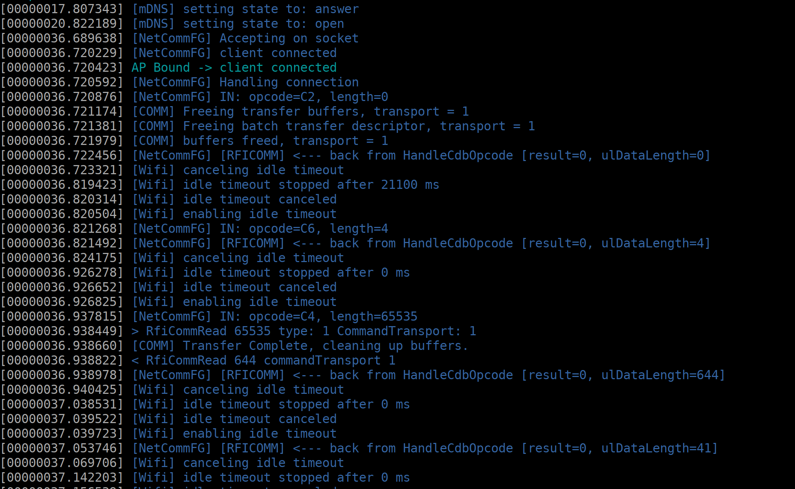
	
#### Demo

There's a short script that demonstrates different functionalities by wiggling the lens, controling zoom and taking a photo:
	
```python
	con = connections.TcpConnection(args.address,int(args.port))
con.connect()
if not args.no_unlock:
	print("Unlocking...")
	tr = transactions.GetCameraInfoTransact(con)
	ci = tr.transact()
	camera_serial = ci.serial_num
	transactions.UnlockTransact(con,camera_serial).unlock()
	print("Unlocked!")

print("Do the lens dance")
transactions.ExecTransact(con,"rfitamron wiggle").transact()
time.sleep(3)
print("Zooming to x3.14...")
transactions.SetZoom(con).transact(payload=b"3.14")
time.sleep(1)
print("Taking photo")
transactions.ExecTransact(con,"rficapture").transact()
```
	
#### LiveView
 
And finaly, an example that shows how to enable live view streaming. Streaming is performed over UDP multicast, and consists simply of transmited jpegs. You can either capture those directly, or instruct ffmpeg to save them. 
	
```python
transactions.UDPLiveView(con).transact(enable=True,cratio=2,fps=1)
utils.keep_alive(con)
```
	
Keep alive function above will periodically issue a query command just to stave off the watchdog which turns of wifi to conserve battery. 

#### Lua code execution

Firmware appears to have support for Lua scripts. This is still a TODO. It would be nice to have a documented way of executing Lua code. 
	

# Ideas?
	
And with that, we have all the components for what we set out to do. We can control zoom and focus, we can telecommand the camera to take a photo and we can stream live view which can be fed into computer vision algorithms. 
There's plenty of squirells in my backyard, but I can take much better photos of them with my regular camera, and most of them are in focus!
	
That being said, I had fun doing this and would love to hear if somebody has any interesting ideas that could benefit from this project. Lightfield cameras are definitely an interesting technology and this might be an affordable way to experiment with them. 
	
Feel free to open issues to ask questions and make pull requests!
	
Cheers,

-- ea

( https://twitter.com/FuzzyAleks / https://infosec.exchange/@FuzzyAleks  )
	
	
